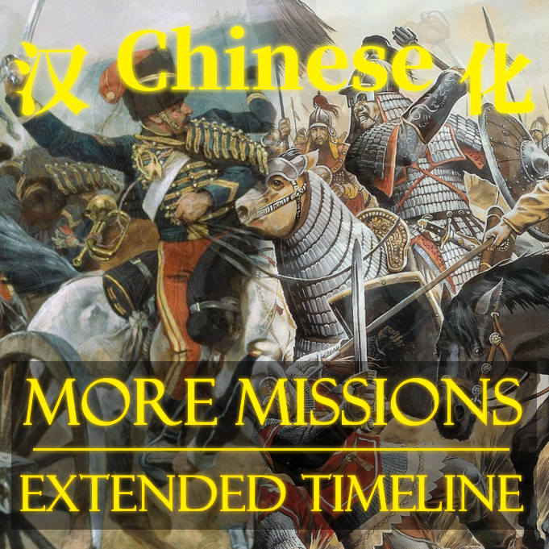

# More Missions: Extended Timeline REDUX Chinese

[](https://paratranz.cn/projects/11020)

[](https://github.com/Cccc-owo/MMETR-Chinese/releases)
[](https://steamcommunity.com/sharedfiles/filedetails/?id=3294451905)
[](https://steamcommunity.com/sharedfiles/filedetails/?id=3294451905)
[](https://github.com/Cccc-owo/MMETR-Chinese/tags)
[](https://github.com/Cccc-owo/MMETR-Chinese/graphs/commit-activity)

「More Missions: Extended Timeline REDUX」模组的中文汉化子模组

[ParaTranz 项目](https://paratranz.cn/projects/11020/)


## 下载 & 使用 / Download & Use

你可以在 [Releases](https://github.com/Cccc-owo/MMETR-Chinese/releases) 中下载到本地版 Mod，或者你也可以在 [Steam 创意工坊](https://steamcommunity.com/sharedfiles/filedetails/?id=3294451905)中找到本 Mod。

<details><summary>本地版使用教程</summary>

~~下载 [Releases](https://github.com/Cccc-owo/MMETR-Chinese/releases/latest) 中的 ```mod.zip```，原样解压 ```mod.zip``` 至 ```文档 > Paradox Interactive > Europa Universalis IV > mod``` 目录下。打开启动器 ```dowser.exe```（正版玩家直接启动游戏相当于打开启动器），在**边栏**的**播放集**一页中，点击右上角的**添加更多 MOD**，将本模组加入播放集。接着确保本模组启用的情况下，关闭其他不兼容的模组（如原版汉化模组、Extended Timeline及其他修改较大的模组），返回主页开始游戏即可。~~

等待更新...

</details>

注意：**想要游玩本MOD，你还需要启用以下几个MOD：Extended Timeline, Extended Timeline Chinese, More Missions: Extended Timeline REDUX**

## 文件夹结构说明 / Folders structure of the repository

|文件夹 / folder|内容 / contents|备注 / notes|
|--------------|---------------|-----------|
|[.github](.github)|GitHub 工作流文件||
|[addition](addition)|整合过程最后需要覆盖的东西|存放有额外加入的文件|
|[cn_text](cn_text)|翻译后的文本文件|使用 EU4 双字节补丁特殊编码，[源项目](https://paratranz.cn/projects/11020/)|
|[MMETR](MMETR)|MMETR 源文件|<https://steamcommunity.com/sharedfiles/filedetails/?id=1671760362>|
|[mod_descriptor](mod_descriptor)|mod 描述符文件||
|output|输出文件夹|运行 ```main.bat``` 时会自动建立|

## 贡献者 / Contributors

见 [ParaTranz](https://paratranz.cn/projects/11020/members)

## 鸣谢 / Credits

[Europa Universalis IV 52 汉化组](https://paratranz.cn/projects/2)

[原 Extended Timeline 汉化项目](https://paratranz.cn/projects/32)

[Extended Timeline 日化项目](https://paratranz.cn/projects/148)

[Extended Timeline 1.29.5 个人汉化项目](https://paratranz.cn/projects/881)

[Extended Timeline Chinese](https://paratranz.cn/projects/5342)
